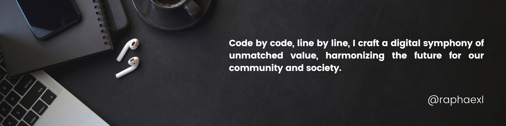

<h1 align="center">Hello I'm Essossolam BATCHASSI</h1>

<!--
**raphaexl/raphaexl** is a ✨ _special_ ✨ repository because its `README.md` (this file) appears on your GitHub profile.
Here are some ideas to get you started: -->

  
  

  

## 👨🏻‍💻 About Me:

- 🙋‍♂️ All about me is at **[ebatchas](https://ebatchas.com/)** yeah currently down 🫣

- 🔭 I’m currently working on `Revolutionizing Healthcare System in Africa`. **[Dokita](https://dokita.tech/)**

- 🌱 I’m currently learning about `Django REST APIs with NextJS`

- 👯 I'm looking to collaborate `on addressing Africa's challenges in the health tech and other tech industries`.

- 👨‍💻 I'm Technology Consultant of **[LIASA](https://liasafrique.com/)** (Ligue autour de la santé Africaine), an organization aiming to unite African healthcare professionals and experts from various fields and countries. LIASA strives to address critical healthcare challenges in Africa through collaboration and collective efforts

- 💬 Ask me about anything, From Web/Mobile Development to 3D Games & Applications Development :sweat_smile:

- ⚡ Fun fact: I enjoy my free time playing guitar

## 🛠️ Technologies and Tools I use:

## ❤️ Let's get connected:

   

## 📊 My GitHub Data:

  
  

